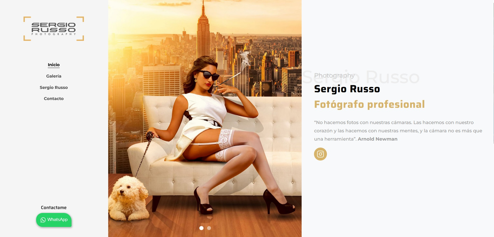
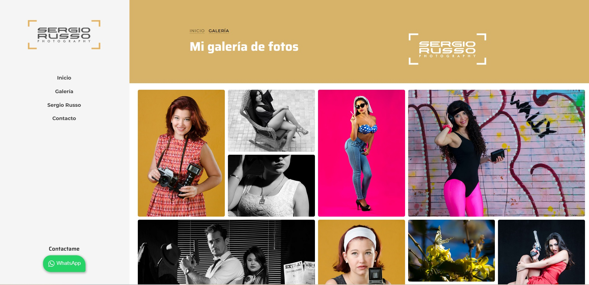

    
 Html y css de <a href="https://github.com/themewagon/louie/tree/master">themewagon louie</a>
    

# Stack

 Astro

 Vue

 JS

- Se eliminaron dependencias de, Bootstrap, Jquery, Aos, Owl carousel e iconos
- Galería Masonry, con PhotoSwipe
- Slider y menú con vue
- Envío de formulario con vue, axios y vue-sonner para toast

